<div align="center">

# KiddieNest

### Daycare updates made simple

Check-ins, daily updates, photos, incidents, and messages from the classroom — live, private, and simple.

<p>
  
  
  
  
  
</p>

<a href="https://kiddienestapp.com"><strong>🌐 Live at kiddienestapp.com →</strong></a>

<br/><br/>

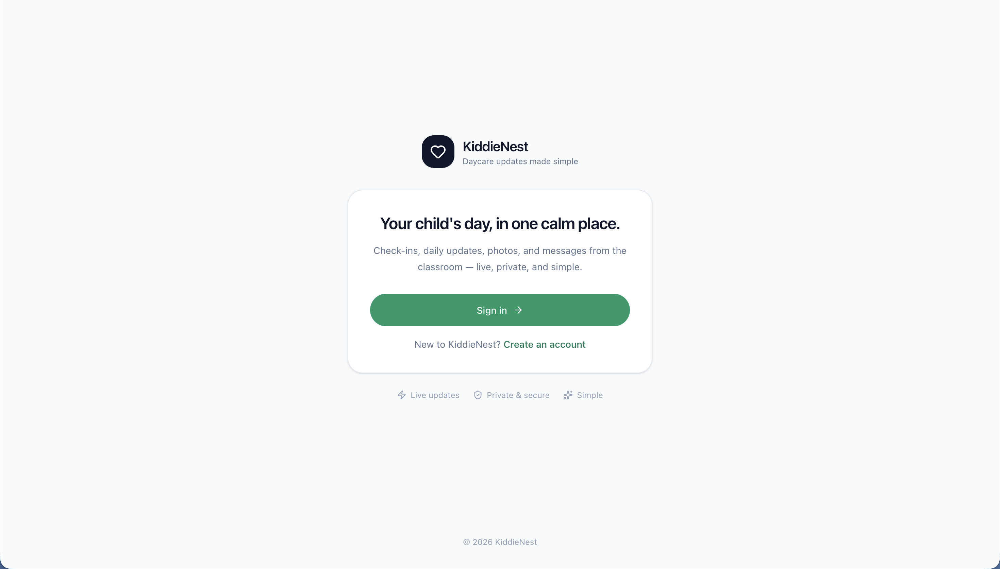

</div>

---

## Table of contents

- [Overview](#overview)
- [Highlights](#highlights)
- [Features](#features)
- [Security and access model](#security-and-access-model)
- [Tech stack](#tech-stack)
- [Architecture](#architecture)
- [How a daycare uses it](#how-a-daycare-uses-it)
- [Running locally](#running-locally)
- [Roadmap](#roadmap)

---

## Overview

**KiddieNest** is a modern daycare-management web app with two sides that stay perfectly in sync:

- a **staff dashboard** for running the day — check-ins, daily updates, incident logs, messaging, and child and staff records, and
- a **private parent portal** where families follow their child's day as it happens.

It's built to feel calm and obvious for non-technical staff, while being trustworthy enough for parents to rely on every day. This is a real, deployed product — not a prototype — running live at **[kiddienestapp.com](https://kiddienestapp.com)**.

## Highlights

- ⚡ **Live by default** — check-ins, updates, incidents, and messages stream in over Supabase Realtime. No refreshing.
- 🔐 **Privacy enforced in the database** — Postgres Row-Level Security guarantees a parent can only ever see their own child, right down to the API layer.
- 👥 **Three roles, three experiences** — Admin, Staff, and Parent each get a tailored, route-protected view.
- 🌗 **Light and dark mode** — a first-class theme that never flashes on load.
- 🎨 **Calm, simple UI** — designed for busy hands and reassuring for families.
- ▲ **Deployed on Vercel** with a custom domain and automatic deploys on every push.

## Features

### A private portal for parents

Families get their own calm view of the day: a live timeline of meals, naps, photos, and activities; incident reports they can read and acknowledge with one tap; direct messaging with their child's teachers; and the child's room and allergy info right up top. **Parents only ever see their own child.**

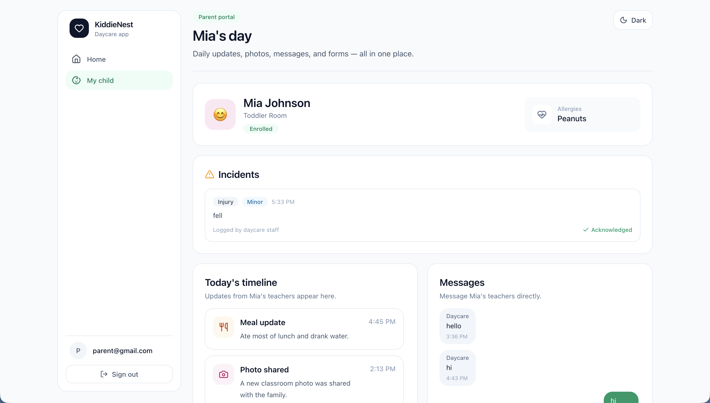

### Check-in and out

Tap a child to mark them **Checked in**, **Checked out**, or **Absent** — the status sticks until you change it, and the live tallies at the top update instantly. Rapid taps are handled with optimistic, correctly-ordered writes, so the board never flickers or reverts to a stale state.

<table>
  <tr>
    <td width="50%">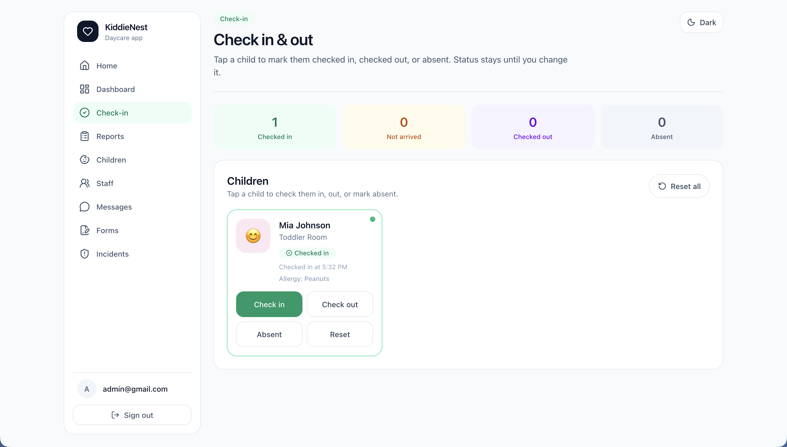</td>
    <td width="50%">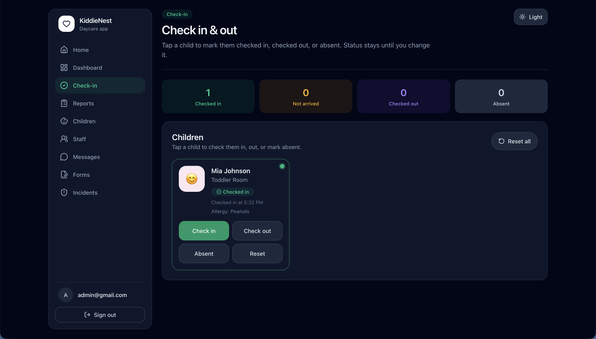</td>
  </tr>
  <tr>
    <td align="center"><sub>Light mode</sub></td>
    <td align="center"><sub>Dark mode</sub></td>
  </tr>
</table>

Every status, at a glance:

<table>
  <tr>
    <td align="center">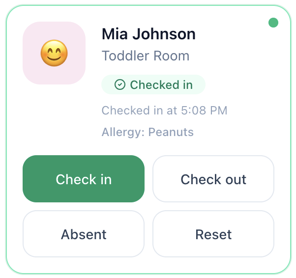<br/><sub><b>Checked in</b></sub></td>
    <td align="center">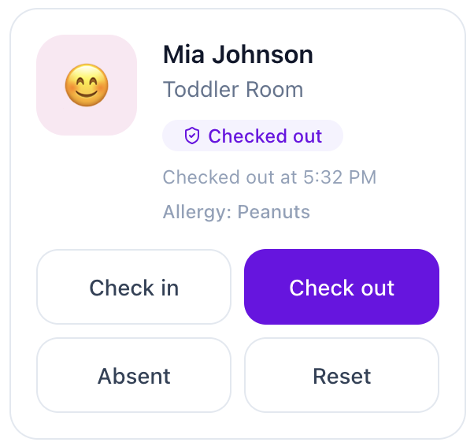<br/><sub><b>Checked out</b></sub></td>
    <td align="center">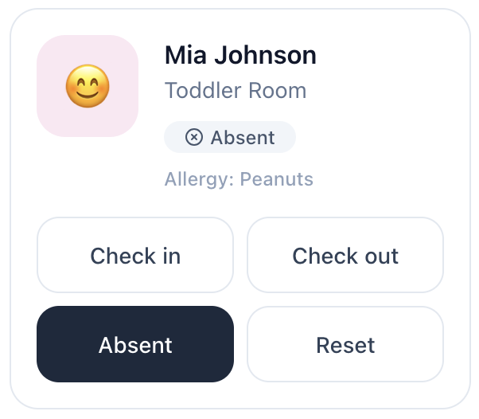<br/><sub><b>Absent</b></sub></td>
  </tr>
</table>

### Daily updates with a live parent preview

Pick a child, choose an update type — meal, nap, photo, note, activity, or incident — write a quick note, and post. A **live preview** shows exactly what the family will see, and the update lands on their timeline in real time.

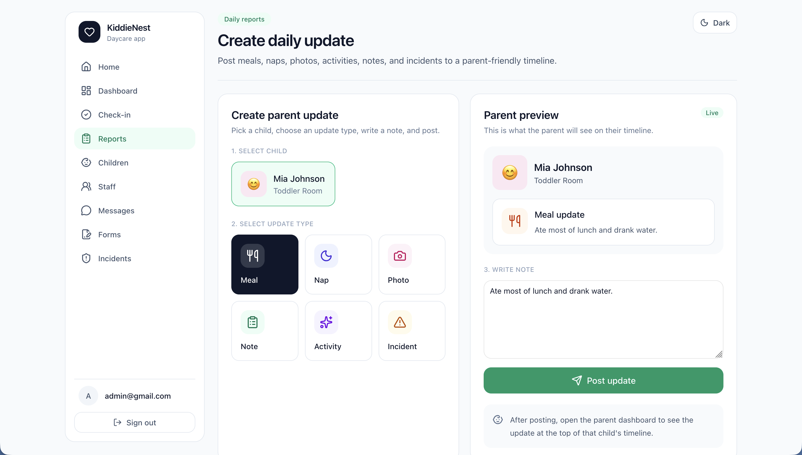

### Incident reporting and acknowledgement

Log injuries, illnesses, or behavior notes with a type, severity, time, what happened, and the action taken. Track which families have seen each one — incidents start as **Awaiting parent** and flip to acknowledged the moment a parent taps **Acknowledge** in their portal.

<table>
  <tr>
    <td width="50%">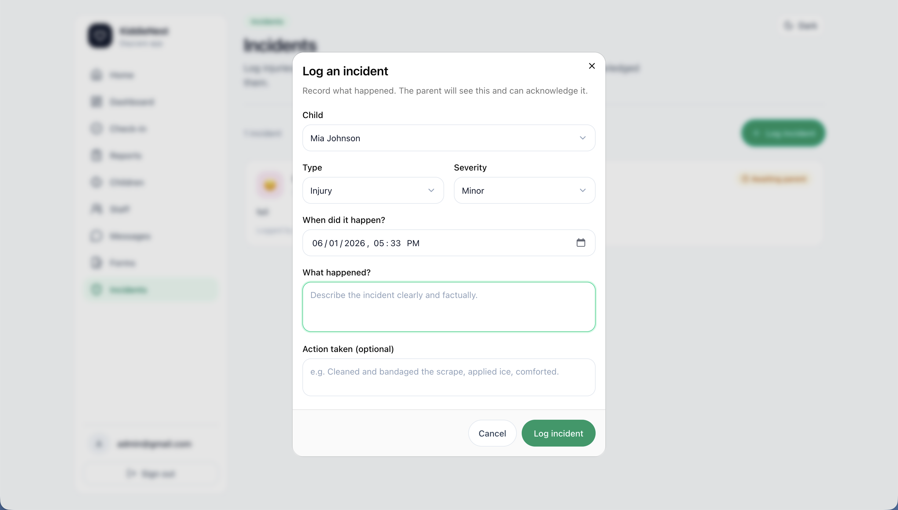</td>
    <td width="50%">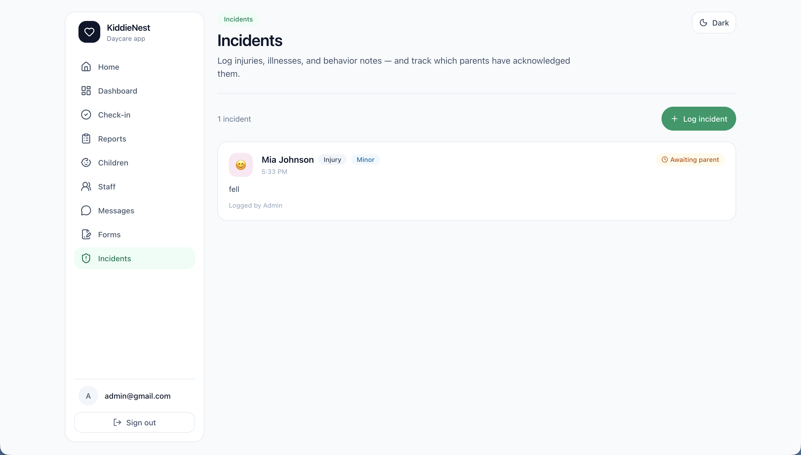</td>
  </tr>
</table>

### Family messaging

Per-child conversation threads keep staff and parents in sync, with a familiar real-time chat experience on both sides.

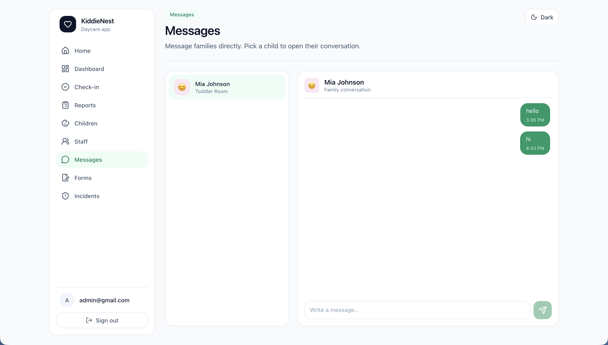

### Child and staff records

**Children** — add and manage every child in your care: room, birthday, allergies, and a friendly emoji avatar. Link families with a simple email invite.

<table>
  <tr>
    <td width="50%">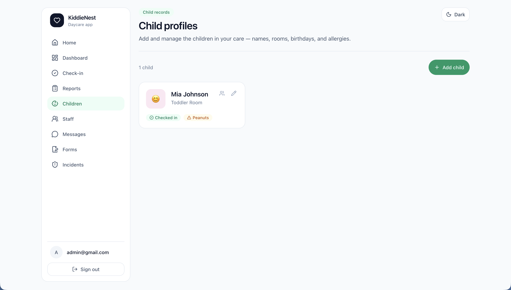</td>
    <td width="50%">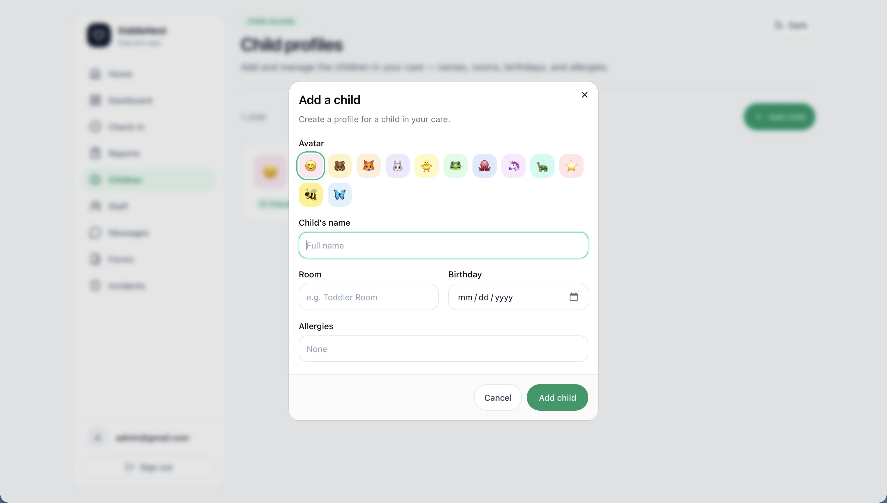</td>
  </tr>
</table>

**Staff** — invite teachers by email and assign Staff or Admin roles. Admins manage the team, and no one can promote themselves.

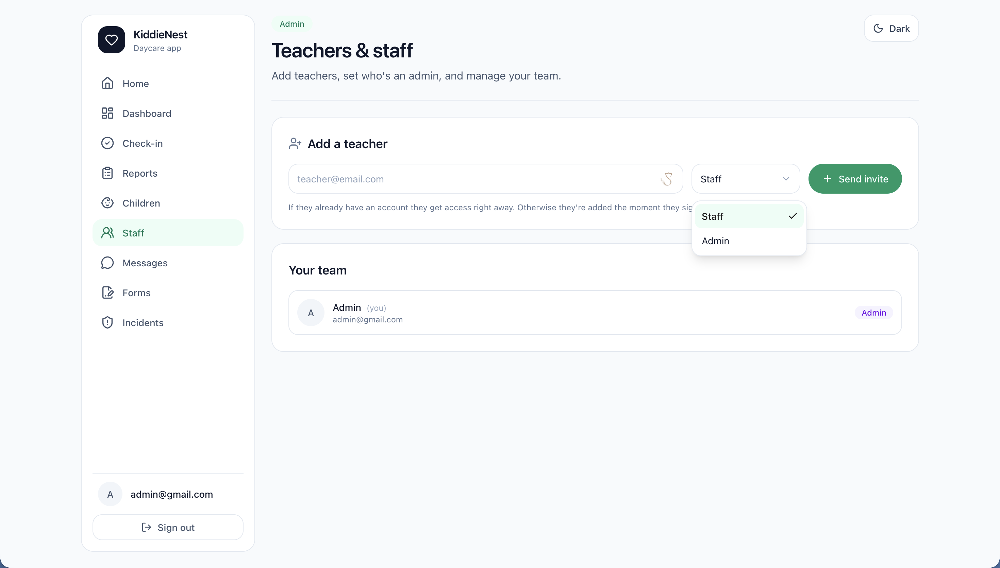

## Security and access model

- **Three roles** — Admin, Staff, and Parent, each with its own navigation and protected routes.
- **Row-Level Security on every table** — the "a parent only sees their own child" rule lives in Postgres, not just the UI, so it holds even if someone hits the API directly.
- **Middleware route protection** — sessions are refreshed on every request and users are gated to the right area for their role.
- **RLS-aware realtime** — instead of trusting data pushed over the socket, each live surface re-fetches through its own protected query when something changes. Realtime can never leak data it shouldn't, and the UI stays flicker-free.

## Tech stack

| Layer | Technology |
| --- | --- |
| Framework | [Next.js 16](https://nextjs.org) — App Router, React Server Components, Server Actions |
| Language | [TypeScript](https://www.typescriptlang.org) |
| UI | [Tailwind CSS v4](https://tailwindcss.com), [shadcn/ui](https://ui.shadcn.com), [lucide-react](https://lucide.dev) |
| Backend | [Supabase](https://supabase.com) — Postgres, Auth, Row-Level Security, Realtime |
| Hosting | [Vercel](https://vercel.com) |

## Architecture

The app is server-rendered with the Next.js App Router. Reads happen in Server Components; writes go through Server Actions straight to Supabase. Auth, data, and authorization all live in Supabase — and crucially, the access rules are enforced by **Row-Level Security in Postgres**, not hidden in the front end.

Live updates use Supabase Realtime. Rather than trusting the payload pushed over the socket, each live surface simply **re-fetches through its own RLS-protected query** when something changes — so realtime stays both secure and flicker-free.

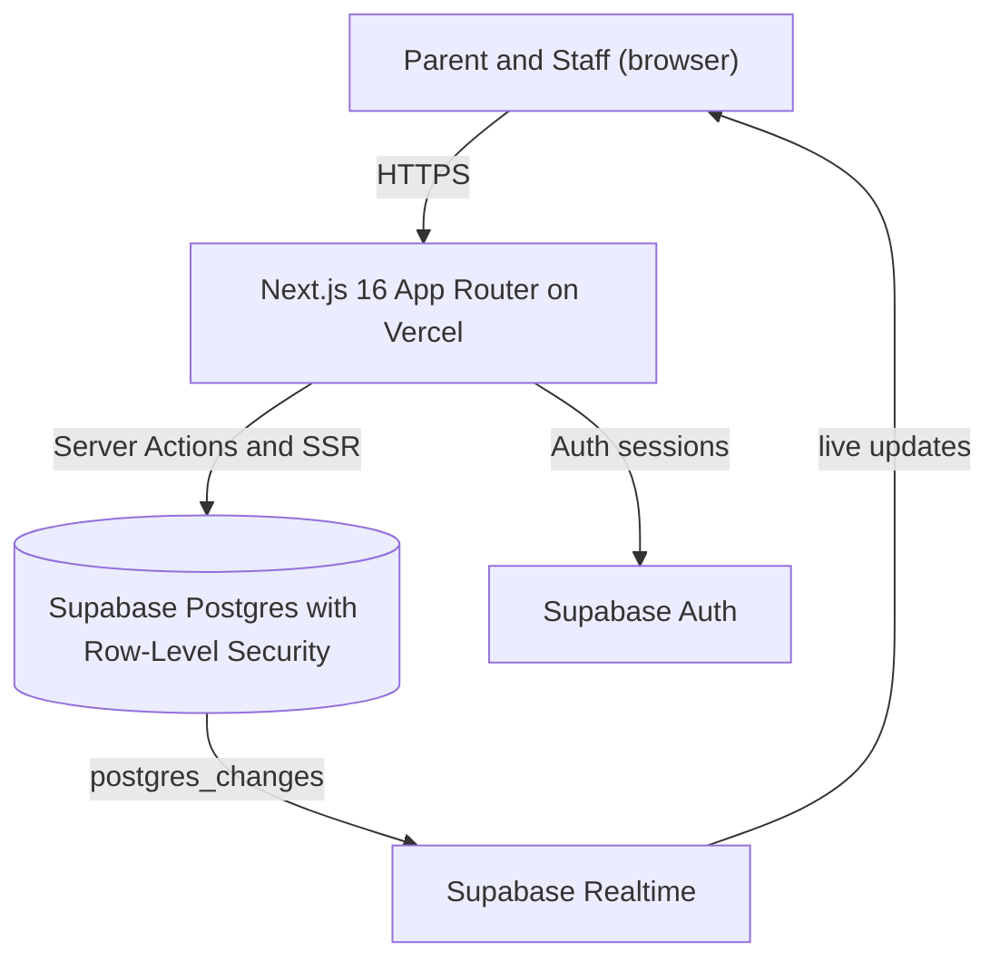

## How a daycare uses it

1. **Admin signs in** and adds the children in their care.
2. **Admin invites parents** by email, and adds teachers as Staff or Admin.
3. **Parents create an account** with that email and are automatically linked to their child.
4. **Staff run the day** — check kids in and out, post updates, log incidents, and message families.
5. **Parents follow along live** from their phone or laptop.

## Running locally

> Requires **Node.js 20+** and a **Supabase** project provisioned with the KiddieNest schema (tables, RLS policies, and RPCs).

```bash
git clone https://github.com/ethanir/careloop.git
cd careloop
npm install
```

Create a `.env.local` file in the project root:

```ini
NEXT_PUBLIC_SUPABASE_URL=your-project-url
NEXT_PUBLIC_SUPABASE_ANON_KEY=your-anon-key
```

Then start the dev server and open **http://localhost:3000**:

```bash
npm run dev
```

## Roadmap

- 📸 **Photo attachments** on daily updates (Supabase Storage)
- 📝 **Digital forms and e-signatures** for enrollment and permissions
- 📱 **Installable PWA** — add KiddieNest to your home screen
- 💳 **Paid sign-up for daycares** — a monthly subscription provisions a private admin account per daycare (no open self-serve admin registration)
- 🏢 **Multi-daycare support** — full multi-tenant isolation so each center sees only its own children, staff, and families

---

<div align="center">
<sub>© 2026 KiddieNest · All rights reserved.</sub>
<br/>
<sub>Built with Next.js and Supabase · <a href="https://kiddienestapp.com">kiddienestapp.com</a></sub>
</div>
